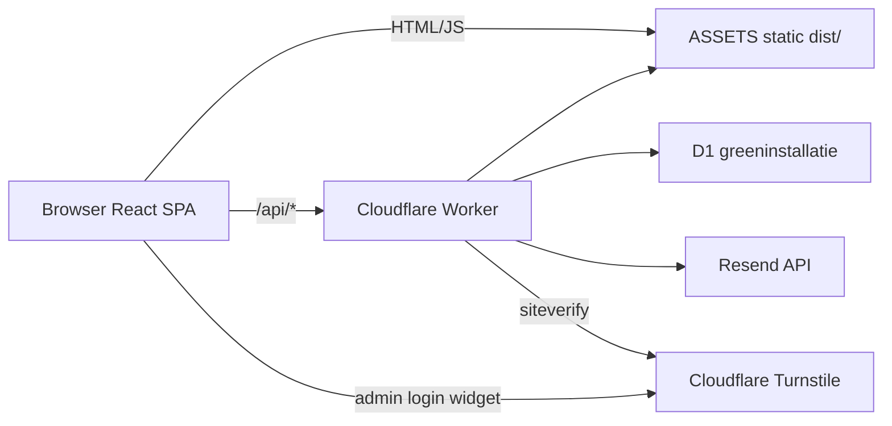

# Green Installatie Noord — Full Stack Production Audit

| Field | Value |
|--------|--------|
| **Auditdatum** | 2026-09-13 |
| **Branch** | `main` (working tree) |
| **Commit hash** | *Niet beschikbaar* — repository heeft nog geen commits (`git` toont “No commits yet on main”; alle bestanden untracked) |
| **Node** | v24.18.0 |
| **npm** | 11.16.0 |
| **Productiedomein** | https://greeninstallatienoord.nl |
| **Telefoon (public)** | 050 569 0997 · `tel:+31505690997` |
| **Admin path** | `/blackberry97` (obscurity only; auth is server-side) |

**Juridische disclaimer (technisch):** technische/contentcontrole uitgevoerd; **geen** formeel juridisch advies.

---

## 1. Executive Summary

Green Installatie Noord is een **Vite + React 19** marketing- en leadwebsite met een **Cloudflare Worker** API, **D1** database, **Resend** e-mail, en een **beveiligd admin-CRM** (afspraken, offertes, contact, klanten, e-mailcomposer, templates).

**Sterke punten**
- Duidelijke scheiding frontend / Worker / D1 / Resend.
- Publieke form flows met server-side validatie, honeypot, idempotency keys, rate limiting.
- Admin-login met Turnstile (fail-closed), PBKDF2, signed HttpOnly session cookie, D1 login throttle.
- Secrets niet in `VITE_*` / client bundle (Resend + session + Turnstile secret blijven Worker-side).
- NAP/telefoon consistent in applicatiecode op 050 569 0997.
- 24/7 storingsdienst vs reguliere uren (ma–vr 07:00–17:00) helder uitgewerkt.
- Cookie/privacy-model gebaseerd op echte registry (geen gefingeerde analytics).
- Legal pages + consent UI aanwezig; productie-build + lint + Worker typecheck slagen.

**Risico’s / beperkingen**
- Geen git-historie → recente wijzigingen alleen uit codebase + sessiewerk af te leiden, niet uit commits.
- Publieke form POSTs **zonder Turnstile**; alleen in-isolate rate limits (zwakker dan D1-backed login throttle).
- Live inbox delivery, echte admin-login, echte form→D1→mail **niet** in deze auditomgeving end-to-end geverifieerd.
- Postcode/BTW/rechtsvorm nog owner-confirmatiepunten (`LEGAL_REVIEW.md` / `business.ts` TODO).
- Sitemap wordt gegenereerd vanuit code maar moet handmatig in `public/` blijven syncen (nu vernieuwd tijdens audit).

### Conclusie

**PRODUCTION READY WITH MINOR ISSUES**

Het systeem is architecturaal en veilig genoeg om live te gaan **mits** productie-env (Resend, session secret, Turnstile, D1 migrations, DNS) correct staat en een gecontroleerde smoke test op productie wordt gedaan. Geen P0-secretleak of frontend-only admin auth aangetroffen. Open issues zijn vooral operationeel (live mail/auth verify), spam-weerstand op publieke forms, en inhoudsconfirmaties.

---

## 2. Architecture Overview

**Flow lead (contact / offerte / afspraak)**  
Browser form → `src/lib/*Service.ts` → `POST /api/{contact|quotes|appointments}` → Worker validatie + D1 insert + optionele klant/admin mails via Resend → admin UI leest D1.

**Flow admin**  
Login + Turnstile → signed cookie `gin_admin_session` → `requireAdmin` op alle admin API’s behalve login/logout → CRUD + e-mailcomposer.

---

## 3. Directory / File Structure

| Path | Rol |
|------|-----|
| `src/` | React SPA: pages, components, admin UI, data, hooks, lib |
| `src/App.tsx` | Publieke + admin route mount |
| `src/admin/` | AdminApp, login, Turnstile field, CRM pages |
| `src/components/` | UI, forms, home, legal, consent, region/map |
| `src/data/` | Business NAP, services, blog, legal copy, SEO, booking |
| `src/config/` | Cookie registry, retention guidelines |
| `src/lib/` | API client, SEO, json-ld, consent, sitemap generator, form services |
| `worker/` | Cloudflare Worker entry, routes, auth, email, Turnstile |
| `migrations/` | D1 SQL 0001–0008 |
| `public/` | Static: robots, sitemap, images, `_headers`, favicons |
| `scripts/` | Password hash, hero image build |
| `docs/` | Interne architectuur/audit notities (niet als SoT voor secrets) |
| `wrangler.toml` | Worker name `greengang`, domain, D1, assets, vars |
| `.env.example` / `.dev.vars.example` | Env **namen** (geen productie-secrets) |
| `LEGAL_REVIEW.md` | Interne legal notes |
| `PROJECT_AUDIT.md` | Dit document |

---

## 4. Routes

| Route | Type | Page | Doel | Status | SEO | Mobile | Notes |
|-------|------|------|------|--------|-----|--------|-------|
| `/` | public | HomePage | Marketing home | OK | LD + meta | OK* | Hero AVIF/WebP |
| `/cv-ketel` | public | ServicePage | Dienst | OK | Service LD | OK* | |
| `/airco` | public | ServicePage | Dienst | OK | Service LD | OK* | Pad is `/airco` niet `/airconditioning` |
| `/warmtepomp` | public | WarmtepompPage | Dienst + calculator teaser | OK | Service LD | OK* | |
| `/service-onderhoud` | public | ServicePage | Onderhoud + plannen | OK | Service LD | OK* | 24/7 banner |
| `/over-ons` | public | AboutPage | Bedrijf | OK | LocalBusiness | OK* | |
| `/werk` | public | WorkPage | Portfolio | OK | meta | OK* | |
| `/werkgebied` | public | AreaIndexPage | Regio + kaart | OK | Area LD | OK* | OSM click-to-load |
| `/werkgebied/:plaats` | public | AreaDetailPage | Stad | OK | meta only | OK* | Geen Place LD |
| `/werkgebied/:plaats/:dienst` | public | AreaServicePage | Lokale dienst | OK | meta only | OK* | |
| `/blog` | public | BlogPage | Kennis hub | OK | Collection | OK* | |
| `/blog/categorie/:categorie` | public | BlogCategoryPage | Categorie | OK | Collection | OK* | |
| `/blog/:slug` | public | BlogArticlePage | Artikel | OK | Article | OK* | |
| `/contact` | public | ContactPage | Contact + storing | OK | ContactPage LD | OK* | Storing vóór form |
| `/offerte-aanvragen` | public | QuotePage | Offerte multi-step | OK | meta | OK* | |
| `/afspraak-maken` | public | AppointmentPage | Afspraak **aanvraag** | OK | WebPage LD | OK* | |
| `/veelgestelde-vragen` | public | FaqPage | FAQ | OK | FAQ LD | OK* | |
| `/privacy` `/cookies` `/algemene-voorwaarden` `/disclaimer` | public | LegalPage | Legal | OK | noindex via robots | OK* | SPA meta index vs robots Disallow |
| `/voorwaarden` | redirect | → AV | Compat | OK | — | — | |
| `*` | public | NotFoundPage | 404 | OK | noindex + echte path | OK* | Fixed during audit |
| `/blackberry97/*` | admin | AdminApp | CRM | OK | noindex | Bruikbaar* | Auth verplicht |

\*Mobile: layout/CSS review + component patterns; **geen** geautomatiseerde viewport-browser matrix in deze omgeving → gedeeltelijk **NIET LIVE GEVERIFIEERD**.

---

## 5. Homepage

| Sectie | Werking |
|--------|---------|
| Hero | `HomeHero` + `HeroSlideshow` (AVIF→WebP→JPG), CTAs offerte/afspraak, 24/7 storingslijn (secundair) |
| TrustMarks | Certificeringssignalen |
| QuickStart / ServiceList | Diensten navigatie |
| ExperienceSection | Praktijkfoto + 3 trust points (service noemt 24/7 zonder te schreeuwen) |
| Calculator teaser | Link naar warmtepomp-content |
| Maintenance teaser | Pakketprijzen + bel-link storingsdienst |
| WhyHome | USP carousel mobiel / grid desktop; trust-item **24/7 storingsdienst** |
| Process / Projects / Knowledge / Local / Follow | Standaard marketingsecties |
| CTASection | Offerte/afspraak + telefoon + storing |
| Footer | NAP, regulier vs 24/7, legal, cookie-instellingen |

---

## 6. Forms

### Contact
- **Frontend:** `ContactForm` — naam, e-mail, telefoon opt., onderwerp opt., bericht, privacy checkbox (niet pre-ticked), honeypot.
- **API:** `POST /api/contact`
- **DB:** `contact_submissions` status `new` + customer upsert
- **Mail:** admin + klant thank-you (hardcoded bodies in Worker)
- **Succes:** `FormSuccess` scroll/focus
- **E2E live:** **NIET LIVE GEVERIFIEERD**

### Offerte
- **Frontend:** multi-step `QuoteForm` (dienst → situatie → gegevens → controle)
- **Foto’s:** alleen metadata (naam/grootte/type); geen binary upload
- **API:** `POST /api/quotes`
- **DB:** `quote_requests`
- **Mail:** admin + `tpl-quote-received-customer` (incl. AV-link in template seed)
- **Succes:** scroll/focus
- **E2E live:** **NIET LIVE GEVERIFIEERD**

### Afspraak
- **Frontend:** `AppointmentFlow` — voorkeursdatum + tijdvenster; copy: aanvraag ≠ bevestiging
- **API:** `POST /api/appointments` → status `pending`
- **Slots:** config/slots endpoints; preference windows skip exacte slot-lock
- **Mail:** admin + customer request confirmation
- **Succes:** dedicated success panel + scroll/focus
- **E2E live:** **NIET LIVE GEVERIFIEERD**

**Drafts:** `sessionStorage` keys `gin-*-draft`; honeypot `website` wordt **niet** meer gepersisteerd (fix tijdens audit).

---

## 7. E-mail Architecture

| Onderdeel | Gedrag |
|-----------|--------|
| Provider | Resend HTTP API (`worker/src/email.ts`) |
| FROM | Settings `from_email` of default `info@greeninstallatienoord.nl` |
| Secret | `RESEND_API_KEY` Worker-only |
| HTML | `escapeHtml` + branded layout |
| Logs | `email_logs` (`sent` / `failed` / `skipped`) |
| Public forms | Hardcoded bodies + template IDs voor logging/CTA |
| Admin composer | DB templates + preview + send + history |
| Failure UX | Public 201 kan `emailWarning` tonen als mail faalt |

**Live delivery test:** **niet uitgevoerd** (geen veilige geconfigureerde inbox/credentials in deze sessie).  
→ *Resend code/configuratie gecontroleerd, maar daadwerkelijke inbox delivery niet live geverifieerd.*

---

## 8. Database

**Systeem:** Cloudflare **D1** (`database_name = greeninstallatie`).

**Migrations (volgorde):**  
`0001_initial_schema` → `0002_admin_templates` → `0003_appointment_v1` → `0004_email_center` → `0005_request_reliability` → `0006_admin_security` → `0007_crm_workflow` → `0008_email_composer`

**Kernentiteiten:** `admins`, `sessions`, `customers`, `appointments`, `quote_requests`, `contact_submissions`, `email_templates`, `email_logs`, `settings`, `submission_keys`, `auth_rate_limits`, `security_events`, `activity_events`, slot rules.

Queries gebruiken prepared statements (parameter binding) → lage SQL-injection kans bij correct gebruik.

---

## 9. Admin Panel

| Pagina | Doel | Security |
|--------|------|----------|
| Login | Email/wachtwoord + Turnstile | Server verify verplicht |
| Dashboard | Tellingen / recent | `requireAdmin` |
| Afspraken / Calendar / New | Pipeline + status + mails | Server |
| Offertes | Pipeline statuses | Server |
| Klanten | Profiel + gekoppelde records | Server |
| Contact | Inbox statuses | Server |
| E-mails / Logs / Templates | Composer + history | Server |
| Settings / Website-info | Config / info | Server |

**Auth:** verborgen pad ≠ security. Elke admin API (behalve login) draait `requireAdmin` + trusted mutation origin check.

**Mobile admin:** responsive layouts/cards aanwezig in code; **niet** volledig live op device getest.

---

## 10. Authentication & Security

| Control | Status |
|---------|--------|
| Session cookie HttpOnly + SameSite=Strict | Ja |
| Secure flag | Alleen bij `ENVIRONMENT=production` |
| Session HMAC | Als `ADMIN_SESSION_SECRET` gezet |
| Turnstile admin login | Fail-closed zonder secret |
| Public forms Turnstile | Nee |
| Rate limit public | In-isolate (P1) |
| Rate limit login | D1 durable + soft isolate |
| CSP / security headers | `public/_headers` |
| Secrets in frontend | Niet aangetroffen |
| XSS in e-mail HTML | Escaping aanwezig; admin CTA href scheme niet strikt geallowlist (P3) |

---

## 11. Cloudflare

| Item | Detail |
|------|--------|
| Worker | `wrangler.toml` name `greengang` (let op naming) |
| Domain | `greeninstallatienoord.nl` custom domain |
| Assets | `./dist`, SPA not-found |
| D1 | binding `DB` |
| `workers_dev` | `true` (P3: extra origin) |
| Observability | enabled |

Env **namen** (geen waarden): zie §18.

---

## 12. SEO

- `PageMeta` / `applySeo`: title, description, canonical, OG/Twitter, robots.
- `public/robots.txt`: Allow `/`; Disallow admin + legal; Sitemap absolute.
- `public/sitemap.xml`: hergegenereerd (32 URLs) tijdens audit; generator `src/lib/sitemap.ts`.
- JSON-LD: LocalBusiness/HVACBusiness, Website, Service, FAQ, Article, ContactPage, breadcrumbs.
- Legal: Disallow in robots; SPA zet soms `index,follow` → crawlers volgen robots.txt (P3 inconsistentie).
- NAP: telefoon/adres/KvK vanuit `business.ts`.

---

## 13. Responsive / Mobile

**Goed (code review):** topbar 24/7 compact; contact quick actions; legal table→cards; forms min-h-11; FAB vs cookie banner; map click-to-load.

**Niet live geverifieerd:** echte devices/viewports 320–1920, chat overlap pixel-perfect, admin tablet UX.

---

## 14. Performance

- Code-splitting per route (Vite chunks).
- Hero: AVIF/WebP + preload in `index.html`.
- Contentfoto’s grotendeels JPG via `MediaImage`.
- Leaflet lazy + user-gated.
- Fonts: self-hosted Fontsource.
- Geen Lighthouse-run in deze audit → scores **NIET LIVE GEVERIFIEERD**.

---

## 15. Accessibility

Aanwezig: focus traps (menu/modals/consent), labels, aria op dialogs, reduced-motion op meerdere scroll/animaties, skip link in RootLayout.

Resterend: admin dichte tabellen op smal scherm; honeypot silent fail (bewust); contrast niet instrumenteel gemeten.

---

## 16. Legal / Privacy

Technische status: privacy/cookies/AV/disclaimer + cookie settings + registry-aligned cookiebeleid.

**Geen claim** dat teksten juridisch waterdicht zijn. Owner: BTW, rechtsvorm, postcode, herroepingspraktijk bij latere overeenkomsten.

---

## 17. External Services

| Service | Doel | Failure |
|---------|------|---------|
| Cloudflare | Hosting, Worker, D1, edge | Site/API down |
| Turnstile | Admin bot protection | Login blocked if misconfigured |
| Resend | Transactional mail | Logged failed/skipped; form can still save |
| OpenStreetMap tiles | Kaart na “Kaart laden” | Fallback UI |

---

## 18. Environment Variables

| Variable | Client/Server | Secret? | Required? | Purpose |
|----------|---------------|---------|-----------|---------|
| `VITE_PUBLIC_SITE_URL` | Client | Nee | Aanbevolen | Absolute URLs |
| `VITE_ADMIN_BASE_PATH` | Client | Nee | Nee (default) | Admin pad |
| `VITE_API_BASE_URL` | Client | Nee | Nee (same-origin) | API base |
| `VITE_TURNSTILE_SITE_KEY` | Client | Nee (public) | Prod admin | Turnstile widget |
| `PUBLIC_SITE_URL` | Worker | Nee | Ja | Absolute links in mail |
| `ADMIN_BASE_PATH` | Worker | Nee | Ja | Align met frontend |
| `ENVIRONMENT` | Worker | Nee | Ja | Secure cookie / prod checks |
| `RESEND_API_KEY` | Worker | **Ja** | Prod mail | Resend |
| `ADMIN_SESSION_SECRET` | Worker | **Ja** | Prod | Session HMAC |
| `TURNSTILE_SECRET_KEY` | Worker | **Ja** | Prod admin | siteverify |
| `TURNSTILE_EXPECTED_HOSTNAME` | Worker | Nee | Prod | Hostname allowlist |
| `DB` / `ASSETS` | Worker bindings | — | Ja | D1 / static |

Configured locally / production expected: **NIET LIVE GEVERIFIEERD** (geen `.dev.vars` gelezen; secrets mogen niet in audit).

---

## 19. Tests Performed

| Test | Resultaat |
|------|-----------|
| `npm run lint` | **PASS** (na audit-fixes) |
| `npm run typecheck:api` | **PASS** |
| `npm run build` (`tsc -b && vite build`) | **PASS** |
| Sitemap regenerate → `public/sitemap.xml` | **PASS** (32 URLs) |
| Browser UI smoke (alle pages klikken) | **NIET LIVE GEVERIFIEERD** |
| Form submit → D1 → Resend | **NIET LIVE GEVERIFIEERD** |
| Admin login + Turnstile | **NIET LIVE GEVERIFIEERD** |
| Resend inbox delivery | **NIET LIVE GEVERIFIEERD** |
| Automated a11y/Lighthouse | **NIET UITGEVOERD** |
| `npm audit` / dependency CVE scan | **NIET UITGEVOERD** |
| Destructive DB tests | **NIET UITGEVOERD** (bewust) |

Code-path review van forms, Worker routes, auth, email escaping: **uitgevoerd**.

---

## 20. Changes Made During Audit

| Bestand | Waarom |
|---------|--------|
| `src/hooks/useSessionDraft.ts` | Honeypot `website` niet meer in sessionStorage |
| `src/components/forms/AppointmentFlow.tsx` | `maxLength` telefoon |
| `src/pages/NotFoundPage.tsx` | Canonical = echte 404-path + noindex |
| `src/data/business.ts` / `site.ts` / `src/lib/seo.ts` | Stabiele `regionCode` voor geo meta |
| `src/lib/sitemap.ts` + `public/sitemap.xml` | lastmod + sync |
| `.env.example` / `.dev.vars.example` | Turnstile env **namen** gedocumenteerd |

---

## 21. Known Issues

### P1
- **Public form spam:** geen Turnstile; isolate-local rate limit. Impact: Resend/D1 kosten & noise. Advies: D1-backed limit en/of Turnstile op public POSTs.
- **Live ops niet geverifieerd:** mail, login, migrations remote. Advies: deploy checklist §23.

### P2
- Preference-time appointments kunnen meerdere records/dag (geen exacte slot unique).
- Area detail/service pages zonder structured Place/Service LD.
- Legal SPA `index,follow` vs robots Disallow.
- Postcode TODO / geen BTW/rechtsvorm in `business.ts`.
- Wrangler Worker name `greengang` vs merknaam (verwarring).

### P3
- `workers_dev = true` op productie-config.
- Admin CTA URL scheme niet strikt geallowlist.
- Dead `PlaceholderNote` component.
- Sitemap niet geautomatiseerd in `npm run build`.
- Oude telefoonnummers in **docs/** historisch — niet in `src/`/`worker/` runtime.

---

## 22. Recommended Next Improvements

**Before launch**
- [ ] Secrets + Turnstile hostname op productie
- [ ] D1 remote migrations toepassen
- [ ] Gecontroleerde testmails (contact/offerte/afspraak/admin)
- [ ] Admin login smoke + session expiry check
- [ ] NAP/postcode/BTW owner sign-off

**Soon after launch**
- Public Turnstile of durable rate limit
- Sitemap generate stap in build
- Lighthouse CI / real device pass
- Retention/purge jobs matching privacy table

**Nice-to-have**
- First-party map tiles
- Area page JSON-LD
- Automated E2E (Playwright)

---

## 23. Deployment Checklist

- [ ] `RESEND_API_KEY` (secret)
- [ ] `ADMIN_SESSION_SECRET` (secret)
- [ ] `TURNSTILE_SECRET_KEY` (secret)
- [ ] `VITE_TURNSTILE_SITE_KEY` in Pages/build
- [ ] `TURNSTILE_EXPECTED_HOSTNAME=greeninstallatienoord.nl`
- [ ] `ENVIRONMENT=production`
- [ ] `PUBLIC_SITE_URL=https://greeninstallatienoord.nl`
- [ ] D1 migrations remote applied
- [ ] Admin user hashed password set
- [ ] Resend domain/DNS/SPF/DKIM
- [ ] `npm run build` + `wrangler deploy` (of CI)
- [ ] robots.txt + sitemap.xml live
- [ ] HTTPS / custom domain
- [ ] Form smoke tests
- [ ] Admin auth smoke
- [ ] Backup/export strategy for D1
- [ ] Observability/logs bekeken

---

## 24. Emergency / Rollback Notes

- Deploy: `npm run deploy` = build + `wrangler deploy` (uit `package.json`).
- Rollback: Cloudflare dashboard previous Worker/Pages deployment — **exacte UI-stappen niet uit repo af te leiden**.
- Logs: Worker observability enabled in `wrangler.toml`; Resend dashboard + `email_logs`.
- Kritieke externe diensten: Cloudflare, D1, Resend, Turnstile.

---

## 25. Final Verdict

### PRODUCTION READY WITH MINOR ISSUES

| Domein | Score | Motivatie |
|--------|------:|-----------|
| Security | **7.5/10** | Sterke admin auth; public forms zwakker tegen spam |
| Frontend | **8/10** | Solide SPA, duidelijke flows, consistente design language |
| Mobile UX | **7.5/10** | Goede patterns; geen live device matrix |
| Backend | **8/10** | Heldere Worker/D1/API; validatie aanwezig |
| Admin | **7.5/10** | Feature-rijk CRM; live UX niet volledig getest |
| E-mail | **7/10** | Architectuur OK; delivery **niet** live bewezen |
| SEO | **7.5/10** | Meta/LD/sitemap/robots aanwezig; kleine inconsistenties |
| Performance | **7/10** | Goede hero pipeline; geen CWV-meting |
| Accessibility | **7/10** | Focus/ARIA/basis; geen formele audittool-run |
| Maintainability | **7.5/10** | Duidelijke modules; nog geen git-historie/commits |

**Eindoordeel:** klaar om productie te zetten na checklist §23 en een korte live smoke (forms + mail + admin). Geen reden tot “NOT PRODUCTION READY” op basis van aangetroffen architectuurfouten of secret leaks; wel expliciet “minor issues” door niet-live-geverifieerde ops en public-form spam surface.
